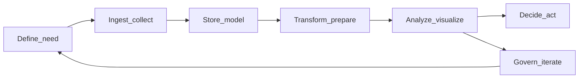

# What is Business Intelligence?

Most dashboards are never used. That is not a dig at designers or tools; it is a symptom of something deeper. Companies rarely lack data anymore—they lack *clarity*: a shared picture of what matters, whether the numbers are trustworthy, and what to do when they move.

You can collect perfect data and still make bad decisions if nobody agrees on the question, the metric, or the next step. Organizations invest heavily in pipelines, warehouses, and visualization licenses, yet turning all of that into *useful* choices—faster, calmer, and more aligned—is surprisingly hard.

This article explains what **Business Intelligence (BI)** actually is, how it differs from related roles in the data world, and how the full analytics workflow tends to work in practice. If you are new to the field, exploring analytics as a career, or simply trying to understand what people *do* with data beyond the buzzwords, you are in the right place.

---

## 2. What is Business Intelligence?

### 🧾 One-line summary

**Business Intelligence (BI)** is the practice of turning raw data into **trusted, actionable information** so people can decide what to do next. It is less about the novelty of the dataset and more about whether the organization can rely on the story the numbers tell.

---

### 🧩 A concrete example

Picture an e-commerce company you are responsible for. Every day you care about revenue, conversion rate, and whether new customers come back. Those metrics live in orders, sessions, campaigns, and support tickets—messy, fragmented, and easy to misread if definitions drift.

BI is what helps the team ask grounded questions and get answers everyone can stand behind: *Why did revenue dip last week—was it traffic, price, or fulfillment?* *Which regions lag on conversion even when traffic looks healthy?* *Are first-time buyers returning within thirty days, and is that getting better or worse?* The domain changes, but the shape of the work does not—similar questions appear wherever leaders care about demand, efficiency, and whether customers stay.

---

### 📌 Definition (expanded)

In practice, BI work clusters around three kinds of activity.

**Reporting** answers *what happened*: period closes, executive summaries, board packs, and the “source of truth” views finance and operations argue from. **Monitoring** answers *what is happening now*: thresholds, alerts, operational dashboards, and the daily rhythm of checking whether reality still matches the plan. **Exploration** stays inside questions the business already knows it cares about—slicing performance by channel, cohort, or geography—not open-ended research for its own sake (that often sits closer to analytics or data science, depending on the org).

The through-line is decision support: making the current state of the business legible, comparable over time, and tied to actions people can take.

---

### 🚫 What BI is NOT

BI is not synonymous with a wall of charts. Dashboards can be part of the delivery, but if nobody agrees what a metric means—or whether the pipeline feeding it is complete—pretty visuals only speed up confusion.

It is not “whoever knows Excel or Tableau,” either. Tools matter, yet they are instruments. The hard parts are definitions, ownership, refresh logic, access, and the meetings where someone says, “I don’t believe this number.” Likewise, BI is not “running queries” as a hobby. Queries serve questions; without a shared question, you get fast answers to the wrong problems.

At its best, BI is a **system of people, processes, and tools** working together: stewards who care about definitions, operators who keep data fresh, and leaders who use the output to steer.

---

### 📊 Typical outputs

Teams express BI work in familiar artifacts: **dashboards and scheduled reports** for recurring decisions; **KPI packs** that anchor reviews and targets; **ad hoc analyses** when something breaks pattern and the business needs a narrative with numbers; and **data models or semantic layers**—the hidden scaffolding that says “revenue” and “active user” the same way in every report. None of these outputs are magical on their own; they are useful when they reduce debate about the facts and move energy toward choices.

---

### 🧠 Core themes

Three themes show up in almost every mature BI effort.

**Trust** means consistent definitions, documented logic, and reliable pipelines. When trust is low, every meeting reopens the same argument about how the metric was built.

**Relevance** means the work is anchored in decisions the business actually makes—pricing, staffing, inventory, budget—not vanity charts that look impressive in a demo.

**Accessibility** means the right people see the right view at the right time: executives get the rollup, operators get the drill-down, and nobody has to file a ticket to learn whether yesterday was normal.

---

### ⚠️ Common misconceptions

**“More data automatically means better decisions.”** Volume helps only when people agree on definitions, know what is missing, and have a forum to act on what they learn. Otherwise, more rows mostly mean more ways to disagree.

**“BI equals dashboards.”** Dashboards are a delivery channel. BI is the discipline that decides what belongs on them, how often they refresh, and what to do when the line moves.

**“Buying a tool means we have BI.”** Tools accelerate work they understand. They do not replace clarity, ownership, or process. The organizations that get value from BI invest in all three—not just the license.

---

## 3. BI vs Data Science vs Data Engineering

### 🧾 One-line summary

**BI, data science, and data engineering** all depend on the same pools of data, yet they optimize for different risks: clarity for operators, evidence for uncertainty, and reliability at scale. Confusing them is less a moral error than a planning error—you ship the wrong work, to the wrong audience, on the wrong timeline.

---

### 📊 Comparison table

The table below is a caricature on purpose. Real jobs bleed across columns. Still, the *center of gravity* usually holds: each discipline has a default question it is trying to answer first.

| Lens                 | BI                            | Data Science             | Data Engineering                    |
| -------------------- | ----------------------------- | ------------------------ | ----------------------------------- |
| **Primary question** | What happened / is happening? | What will happen / why?  | How do we reliably move/store data? |
| **Typical outputs**  | Dashboards, reports           | Models, experiments      | Pipelines, infrastructure           |
| **Time horizon**     | Present / recent past         | Future / deeper patterns | Continuous                          |
| **Audience**         | Business users                | Product / research       | Engineers                           |

---

### 🔄 Role overlap (important)

In a small company, one person often owns ingestion, modeling, reporting, and the occasional forecast. Titles say “data person,” and the job is whatever keeps the business from flying blind. As teams grow, work **specializes** so that deep reliability work does not compete for the same calendar as weekly business reviews.

That specialization is why hybrid roles appear. An **analytics engineer** (naming varies) usually sits closer to **data engineering** and **BI**: they build the transformations, tests, and semantic layers that make metrics stable enough for dashboards *and* trustworthy enough for analysts to extend. They are not the whole field—but they are a useful example of how the boundaries blur in healthy teams.

---

### 🧠 Key takeaway

Use a simple mnemonic when you are lost in titles: **BI leans toward understanding and monitoring** the business as it runs today. **Data science leans toward prediction, inference, and discovery**—often with more statistical caution and experimentation. **Data engineering leans toward moving, storing, and serving data** so the other two are not guessing about freshness, completeness, or cost. None of that implies hierarchy; it implies **division of labor**.

---

### 🤔 Why this is confusing

Job ads reuse the same keywords—“SQL,” “Python,” “modeling,” “stakeholders”—for roles that spend their weeks differently. Internal titles drift: “analyst” might mean reporting, might mean experimentation, might mean pipeline glue. Vendors blur the story further by claiming one platform covers “end-to-end analytics,” which is sometimes true for a narrow stack and sometimes marketing.

When you read a role or plan a hire, ignore the label for a moment and ask: **Is the primary risk that we cannot explain last month, that we cannot predict next month, or that the data never arrives intact?** The answer usually points you to the right center of gravity—even if one human still does two jobs on Tuesday.

---

## 4. The end-to-end analytics workflow

### 🧾 One-line summary

BI is not a single step—it is a **loop** that connects **questions → data → decisions**, then feeds what you learned back into the next question. If you only picture the middle of that loop (charts and SQL), you will wonder why “insights” rarely change behavior.

---

### 🔄 Visual flow

Read the diagram left to right as the *happy path*: define what you need, bring data in, land it somewhere durable, shape it into metrics, present and explore it, then decide. The return edges matter: **governance** follows analysis because trust issues show up when people use the work, and **governance** returns you to **definition** because every failure mode eventually becomes a requirements conversation.

---

### 🧩 Simple mental model

A compact chain still helps, as long as you do not mistake the chain for the whole job:

**Raw data → clean data → metrics → views (dashboards, reports) → decisions.**

Each arrow hides politics and craft: who owns the definition of “clean,” which grain of time is authoritative, whether two departments mean the same word when they say “revenue,” and what happens when the chart says one thing and the field says another. The mental model is a spine; the workflow below is where the muscle attaches.

---

### 📌 Stages

1. **Define the need** — Start with the decision, not the dataset. What question are we answering, for whom, by when, and what would we do differently if the answer were X versus Y? Name KPIs and stakeholders explicitly. This is where most programs quietly fail: vague asks produce heroic SQL and still no alignment. If the need is fuzzy, pause. Clarity here saves quarters everywhere else.

2. **Ingest / collect** — Identify sources (applications, spreadsheets, events, partners), how often data must arrive, and what “good enough” freshness means for the decision at hand. Contracts matter: who is allowed to change a schema, what identifiers join across systems, and what to do when a source is late or wrong.

3. **Store / model** — Land data in something durable—a warehouse, lake, or hybrid—so it can be queried repeatably. At a light level, think in **facts** (things that happened: orders, clicks) and **dimensions** (context: customer, product, date). Modeling is not academic ornament; it is how you keep “the same number” from meaning five different things in five different tools.

4. **Transform / prepare** — Apply cleaning rules, business logic, and slowly changing realities (returns, refunds, currency). This is where **trusted metrics** are forged: documented definitions, tested transformations, and agreed edge cases. A common failure is inconsistent definitions across teams—everyone is “right” locally, and the business loses a shared reality.

5. **Analyze / visualize** — Explore, compare, and package: ad hoc cuts for investigations, curated dashboards for monitoring, narrative exhibits for reviews. The goal is not maximal chart density; it is legible evidence that survives a skeptical audience.

6. **Decide / act** — Translate what you learned into a change: pricing, staffing, inventory, policy, or a follow-up experiment. Many pipelines stop at the slide. Without owners, forums, and accountability, “insight” becomes entertainment. If nothing on the calendar can change when the metric moves, the metric was never tied to a decision.

7. **Govern / iterate** — Manage access, auditability, lineage, and documentation so the system improves instead of rotting. Governance is not bureaucracy for its own sake; it is how you learn which metrics were wrong, which joins were naive, and which questions need reframing—then route that learning back to step one.

---

### 🔁 Key insight

Treat the workflow as a **loop**, not a conveyor belt that ends at a dashboard. Decisions surface new questions; failures surface new rules; usage surfaces new trust issues. The visuals are one checkpoint in a longer circuit.

> BI is less about building dashboards, and more about maintaining a reliable loop between questions, data, and decisions.

---

## 5. What makes BI hard?

BI is difficult less because SQL is tricky and more because organizations are tricky. Four failure modes show up again and again.

**Ambiguous metric definitions.** Everyone says “revenue,” but one table includes tax, another excludes refunds, and a third counts bookings instead of cash. Until definitions are explicit, documented, and tested, debates look technical and are actually political. The question *what is revenue, for this decision, as of today?* is not pedantry—it is the work.

**Multiple sources that disagree.** CRM, billing, and product analytics rarely match perfectly. Resolving that tension takes judgment: which source is authoritative for which purpose, how to reconcile identities, and what to do when a feed is late. Without that discipline, teams optimize for whichever dashboard loads fastest.

**Misalignment between stakeholders.** Leaders want confidence; operators want drill-downs; finance wants auditability; engineers want stable schemas. BI sits where those needs collide. When goals, timelines, and success criteria are not shared, the output becomes a pile of artifacts instead of a decision system.

**Insights that never become decisions.** A chart can be correct and still useless if no one owns the next step, if incentives punish changing course, or if the meeting ends with “interesting” instead of “therefore we will.” The hardest part of BI is often not analysis—it is the last mile from evidence to action.

---

## 6. Closing

### 🔁 Recap

**Business Intelligence** is the discipline of turning data into **trusted, actionable information**—through reporting, monitoring, and bounded exploration—supported by people, process, and tools, not by charts alone. It sits alongside **data science** (prediction and deeper inference) and **data engineering** (reliable movement and storage of data); in the real world those boundaries blur, but the centers of gravity differ. The work unfolds as a **loop** from defining the need through ingestion, modeling, transformation, analysis, action, and governance, then back again.

If the opening line about unused dashboards felt cynical, treat it as a challenge: clarity is possible when definitions are owned, workflows are honest about disagreement, and metrics are tied to choices someone can actually make. That is what “from data to decisions” is supposed to mean.
