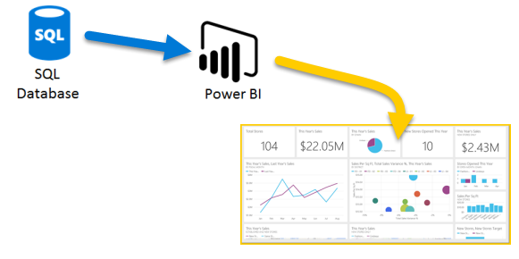

# Building Reliable Metrics: Aggregations, Joins, and Window Functions

This post is about how to **compute metrics correctly in SQL**.

We’ll walk through the common places things go wrong, especially the subtle ones where the numbers *look right*, but aren’t.

In Part 1, we focused on how to think: defining metrics, grain, and questions.
In this post, we shift to execution, what actually breaks when you start writing SQL, and how to avoid it.



---

## 1. Metric Design in SQL

Writing SQL is easy.
Getting the *right number* is the hard part.

This section is about making sure your metrics actually reflect what you think they do, not just producing a query that runs.

### **COUNT vs COUNT DISTINCT**

A very common mistake:

```sql
-- Bad: counts events, not users
SELECT COUNT(user_id) FROM events;

-- Good: counts unique users
SELECT COUNT(DISTINCT user_id) FROM events;
```

If your table has multiple rows per user (which most do), `COUNT` will overstate the metric.

👉 A simple check:

> “What does one row represent in this table?”

If it’s not one row per user, `COUNT(user_id)` is probably not what you want.

### **Ratio Metrics**

Ratios show up everywhere:

* conversion rate
* retention
* click-through rate

The key rule:

> **The numerator and denominator must be at the same grain.**

```sql
-- Wrong: mixing grains (user vs event)
SELECT COUNT(DISTINCT purchased_user_id) / COUNT(event_id)
FROM ...

-- Right: both at user level
SELECT COUNT(DISTINCT purchased_user_id) / COUNT(DISTINCT user_id)
FROM ...
```

If the grains don’t match, the ratio becomes misleading, even if the SQL runs perfectly.

### **Aggregation Consistency**

When you group data, your metric needs to stay consistent at that level.

Example: retention by country

```sql
SELECT country,
       COUNT(DISTINCT active_users) / COUNT(DISTINCT users)
FROM ...
GROUP BY country;
```

If part of your calculation ignores `country`, you’re mixing levels, and the result won’t mean what you think it means.

👉 A good rule:

> If you `GROUP BY` something, every part of your metric should respect that level.

---

## 2. The Duplication Problem (Joins)

Joins are the **#1 reason BI metrics go wrong**.

### **Why Joins Inflate Metrics**

Example:

```sql id="6z3r8k"
SELECT users.user_id, orders.order_id
FROM users
LEFT JOIN orders ON users.user_id = orders.user_id;
```

If one user has 5 orders, that user now appears 5 times.

That’s called a **fan-out**.

Now look what happens:

```sql id="2l7x0a"
-- Over-counts users
SELECT COUNT(user_id) FROM ...

-- Can also inflate revenue if joined again downstream
```

Nothing in the data looks “broken”, but the meaning has changed.

### **Fan-Out in Practice**

Fan-out gets worse as you join more tables:

* users → orders (1-to-many)
* orders → payments (1-to-many)

Now one user can turn into dozens of rows. At that point, simple aggregations stop being reliable, unless you actively control for it.

If you calculate:
   `revenue_per_user = SUM(payment_amount) / COUNT(user_id)`

The result looks reasonable, but it’s much higher than expected because the numerator and denominator are no longer at the same grain

How to fix it:

* **pre-aggregate** payments per user before joining, or
* compute both numerator and denominator at the **same user-level grain**

👉 The key idea:

> Once fan-out happens, your “unit of analysis” silently changes.

---

## 3. Join Strategies in BI

Choosing the right join is less about syntax, and more about what population you want to represent.

### **Inner vs Left Joins**

* `INNER JOIN` → only keeps rows with matches
* `LEFT JOIN` → keeps all rows from the left table

In BI, `LEFT JOIN` is often safer because it preserves your full population, including “zero activity” cases.

Example:

* counting all users → `LEFT JOIN`
* analyzing only purchasing users → `INNER JOIN` may be fine

### **When Joins Are Dangerous**

Watch out for these patterns:

* **many-to-many joins** → row explosion
* aggregating *after* a fan-out
* chaining multiple one-to-many joins

👉 A simple rule:

> Always understand the relationship before you join.

Ask yourself:

* Is this one-to-one?
* one-to-many?
* or many-to-many?

That answer determines whether your aggregation will still be valid.

### Debugging Joins

When something feels off—slow down and check.

#### **Row Count Checks**

```sql
-- before join
SELECT COUNT(*) FROM users;

-- after join
SELECT COUNT(*) 
FROM users
LEFT JOIN orders ...
```

If row counts increase, ask: *is that expected?*

#### **Distinct Key Validation**

```sql
SELECT COUNT(DISTINCT user_id) FROM joined_table;
```

Compare this to your expected population.

If it changes unexpectedly, your join likely introduced duplication.

#### **Pre-Aggregate Before Joining**

Instead of joining raw tables:

```sql
-- safer pattern
WITH orders_per_user AS (
  SELECT user_id, COUNT(*) AS order_count
  FROM orders
  GROUP BY user_id
)
SELECT u.user_id, o.order_count
FROM users u
LEFT JOIN orders_per_user o
  ON u.user_id = o.user_id;
```

👉 This avoids fan-out completely.

---

## 4. Window Functions for Analysis

Window functions let you compute metrics **across rows without collapsing them**.

Unlike `GROUP BY`, they don’t reduce your dataset, but they *add* information to each row.

A good way to think about them:

> Window functions run calculations over a “window” of related rows, while keeping every row intact.

### **Ranking**

```sql
SELECT user_id,
       RANK() OVER (ORDER BY total_spent DESC) AS spend_rank
FROM ...
```

Use this when you want to compare entities like top users, top products, top regions, without losing the underlying data.

### **Running Totals**

```sql
SELECT date,
       SUM(orders) OVER (ORDER BY date) AS running_total
FROM daily_stats;
```

This gives you cumulative trends over time.

Instead of just “what happened today,” you can see how things build up, useful for growth, revenue tracking, or pacing against targets.

### **Period-over-Period**

```sql
SELECT date,
       orders,
       LAG(orders) OVER (ORDER BY date) AS prev_orders
FROM daily_stats;
```

Window functions make comparisons easy:

* today vs yesterday
* this week vs last week
* this month vs last month

They’re essential for understanding *change*, not just raw numbers.

### **Partitions = “Mini Datasets”**

```sql
SELECT country,
       date,
       SUM(orders) OVER (
         PARTITION BY country 
         ORDER BY date
       ) AS running_country_total
FROM daily_stats;
```

Each `PARTITION` creates a separate “mini dataset.”

Instead of one global calculation, you’re now computing metrics *within each group*—like per country, per product, or per user.

👉 Think:

> `GROUP BY` splits data into groups and collapses them
> `PARTITION BY` splits data into groups but keeps all rows

---

## 5. Key Takeaway

> BI SQL is mostly about preventing incorrect aggregation, not writing complex queries.

Getting metrics right comes down to a few fundamentals:

* controlling duplication
* aligning grain
* choosing the right aggregation
* validating results at each step

---

### **Safe habits in BI SQL**

These habits will save you more time than any advanced SQL trick:

* **aggregate before joining**
* **always check row counts after joins**
* **validate distinct keys** (e.g. `COUNT(DISTINCT user_id)`)
* **build queries step by step** instead of all at once
