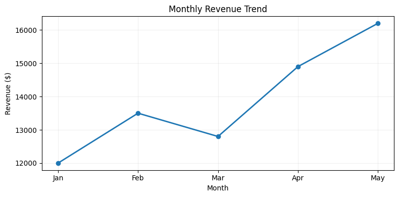
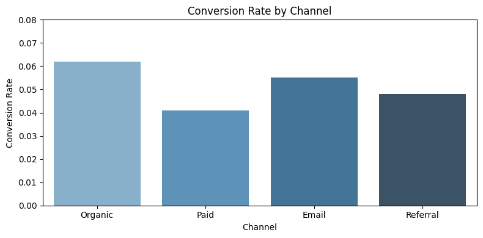
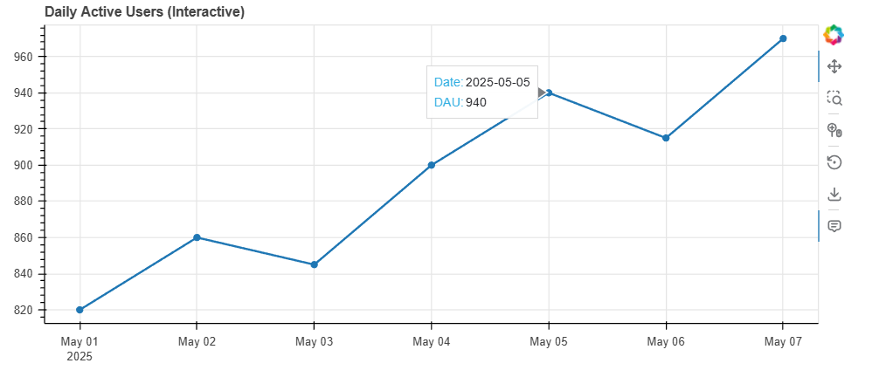

# Pythonfor Business Intelligence (BI): Visualization, Automation & BI Case Study

In the last post, we focused on **EDA thinking**: asking business questions and finding patterns in data.

But finding an insight is only half the job.

If people don’t understand it, or if it doesn’t show up consistently over time, it won’t change anything.

This post is about the next step: turning analysis into **clear visuals and repeatable outputs** that teams can actually use.

---

## 1) Why visualization is communication, not decoration

A chart is not the final product. A decision is.

Stakeholders usually do not need every technical detail behind your analysis. They need clear answers to questions like:

- What changed?
- How big is the change?
- Where should we act first?

That is why clarity beats complexity.

Good BI visuals:

- answer one question clearly
- make comparisons obvious
- remove anything that doesn’t support the message
- use consistent scales so trends are not misleading

If a chart looks impressive but makes the audience ask, "What am I looking at?", it is not doing its job.

---

## 2) Visualization tools in Python

Python gives you a practical tool stack. You do not need every library, just the right one for the job.

### Matplotlib (full control)

Use when you need precise control over layout, axes, annotations, and export format.

- best for production-ready static charts
- reliable foundation for most other plotting libraries

Example (monthly revenue trend):

```python
import matplotlib.pyplot as plt
import pandas as pd

df = pd.DataFrame({
    "month": ["Jan", "Feb", "Mar", "Apr", "May"],
    "revenue": [12000, 13500, 12800, 14900, 16200]
})

plt.figure(figsize=(8, 4))
plt.plot(df["month"], df["revenue"], marker="o", linewidth=2)
plt.title("Monthly Revenue Trend")
plt.xlabel("Month")
plt.ylabel("Revenue ($)")
plt.grid(alpha=0.2)
plt.tight_layout()
plt.show()
```



### Seaborn (fast statistical visuals)

Use when you want clean visuals quickly with sensible defaults.

- excellent for distributions, category comparisons, and relationships
- less boilerplate than raw Matplotlib

Example (conversion rate by channel):

```python
import seaborn as sns
import matplotlib.pyplot as plt
import pandas as pd

df = pd.DataFrame({
    "channel": ["Organic", "Paid", "Email", "Referral"],
    "conversion_rate": [0.062, 0.041, 0.055, 0.048]
})

plt.figure(figsize=(8, 4))
sns.barplot(data=df, x="channel", y="conversion_rate", palette="Blues_d")
plt.title("Conversion Rate by Channel")
plt.xlabel("Channel")
plt.ylabel("Conversion Rate")
plt.ylim(0, 0.08)
plt.tight_layout()
plt.show()
```



### Bokeh (interactive dashboards)

Use when users need to interact with the chart (hover, filter, zoom, select).

- useful for exploratory stakeholder dashboards
- good option when static reports are not enough

Example (interactive daily active users line chart):

```python
from bokeh.plotting import figure, show
from bokeh.models import ColumnDataSource, HoverTool
import pandas as pd

df = pd.DataFrame({
    "day": pd.date_range("2025-05-01", periods=7, freq="D"),
    "dau": [820, 860, 845, 900, 940, 915, 970]
})

source = ColumnDataSource(df)
p = figure(
    x_axis_type="datetime",
    title="Daily Active Users (Interactive)",
    width=800,
    height=350,
    tools="pan,wheel_zoom,box_zoom,reset,save"
)

p.line("day", "dau", source=source, line_width=2)
p.circle("day", "dau", source=source, size=6)
p.add_tools(HoverTool(
    tooltips=[("Date", "@day{%F}"), ("DAU", "@dau")],
    formatters={"@day": "datetime"}
))

show(p)
```



Quick rule of thumb:

- start with Seaborn for speed
- switch to Matplotlib for precision
- use Bokeh when interactivity is a requirement

---

## 3) Designing BI-ready visuals

Most BI reporting needs three visual families: trends, comparisons, and distributions.

### Trends (over time)

Best chart: line chart

Use for:

- weekly revenue
- monthly retention
- support ticket volume by day

Design tips:

- keep time intervals consistent
- annotate major events (launch, pricing change, campaign)
- avoid too many lines in one chart

### Comparisons (across groups)

Best chart: bar chart (horizontal bars often read better)

Use for:

- revenue by region
- conversion by channel
- churn by plan type

Design tips:

- sort bars by value
- keep axis starting point honest
- use one highlight color for the key segment

### Distributions (shape and spread)

Best chart: histogram, boxplot, violin plot

Use for:

- order value distribution
- session duration spread
- time-to-conversion variability

Design tips:

- show median or percentile markers when useful
- pair distribution plots with summary metrics to avoid misreading

---

## 4) Automation in BI workflows

One-off analysis is useful. Repeatable analysis is what creates long-term business value.

Automation helps you move from "manual analyst output" to "reliable operating process."

Common automation pieces in Python:

- scheduled scripts (daily/weekly KPI refresh)
- data export to CSV/Excel for business teams
- auto-generated charts and summary files
- optional email or Slack delivery

Simple example flow:

1. Pull latest data from warehouse/API.
2. Clean and validate core fields.
3. Recompute KPIs and segment metrics.
4. Save charts and tables to an output folder.
5. Publish or send to stakeholders.

Benefits:

- less repetitive work
- fewer manual errors
- consistent definitions over time
- faster decision cycles

---

## 5) End-to-end BI case study

Let us walk through a realistic mini-case: **monthly churn analysis** for a subscription product.

### Business question

Why did churn increase this month, and what should we do first?

### Step A: Raw data to clean table

Assume we have user-level data:

- `user_id`
- `plan_type`
- `region`
- `signup_date`
- `is_active_this_month`
- `is_active_last_month`

First, clean:

- remove duplicate user rows
- standardize plan and region names
- handle missing values for activity flags

### Step B: Build churn metric

Definition:

`churn_rate = users_active_last_month_but_not_now / users_active_last_month`

This definition should stay stable across all reports.

### Step C: Segment and visualize

Break churn by:

- plan type
- region
- signup cohort

Then visualize:

- line chart for monthly churn trend
- bar chart for churn by segment
- distribution of user lifetime before churn

### Step D: Example insight

You find:

- overall churn rose from 4.1% to 6.3%
- increase is concentrated in `Basic` plan users in one region
- churn spike starts right after a recent onboarding change

### Step E: Recommendation

Prioritize highest-impact actions:

1. Fix onboarding friction for `Basic` users in the affected region.
2. Run a win-back campaign for recent churned users in that segment.
3. Track weekly churn for four weeks to measure recovery.

This is the full BI loop:

Raw data -> cleaned metrics -> visual evidence -> targeted action.

---

## Final takeaway

EDA helps you find the pattern.  
Visualization helps others understand it.  
Automation helps the organization act on it consistently.

That is the core value of modern BI: not just analysis, but repeatable insight delivery.
